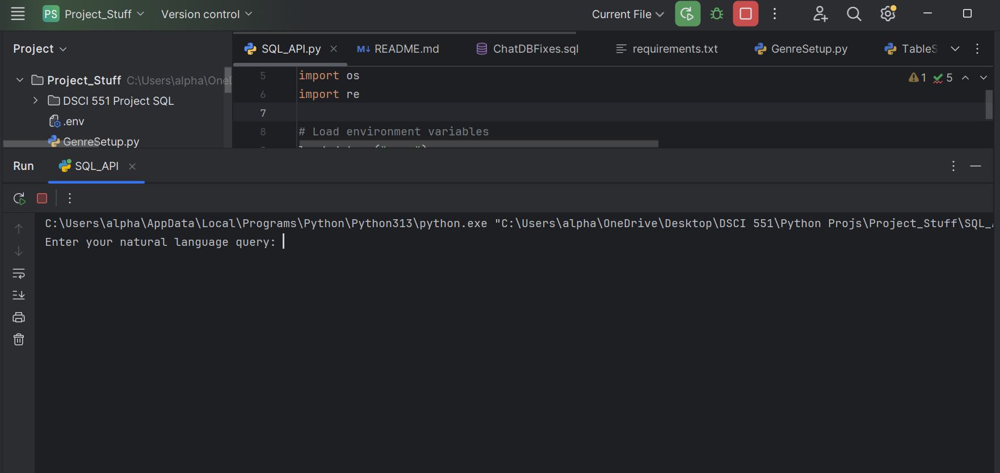
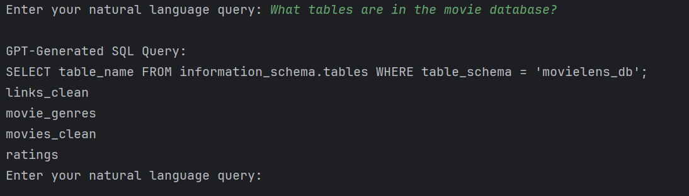
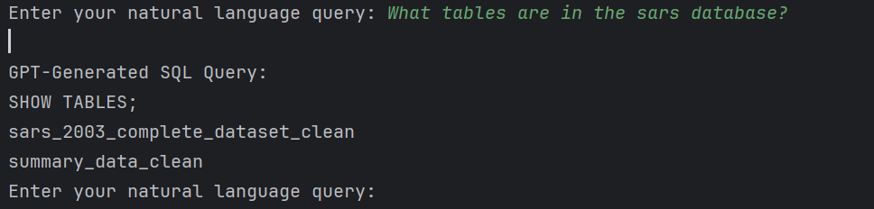
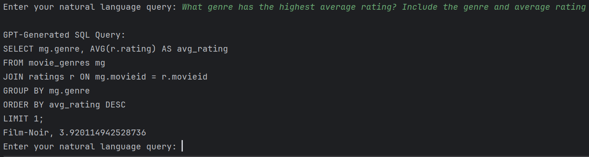
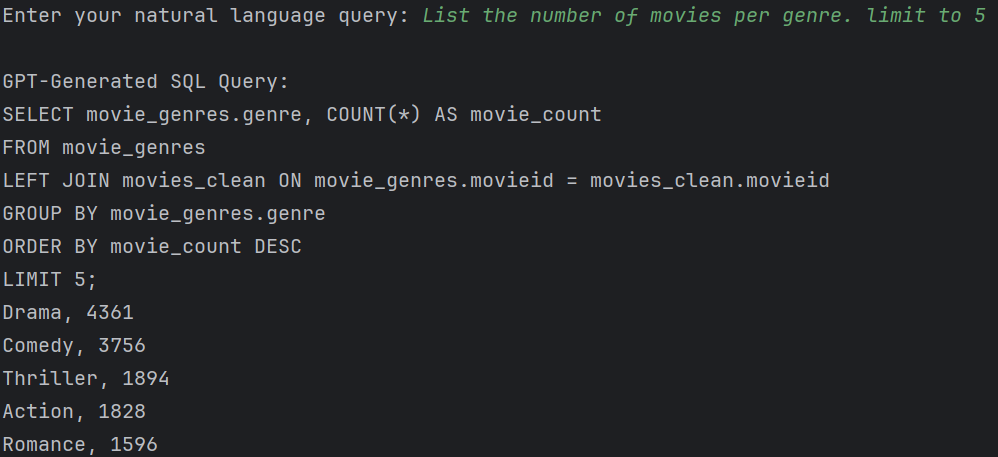
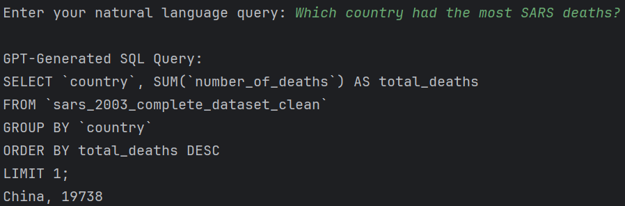
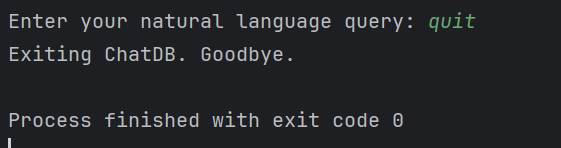

This project implements a natural language interface that allows users to
interact with MySQL databases using plain English queries. It supports multiple 
databases (SARS and MovieLens) and uses OpenAI's GPT API to translate natural 
language into executable SQL.

---

# Project Structure

```
Project_Stuff/
├── SQL_API.py
├── TableSetup.py
├── GenreSetup.py
├── .env              # Contains environment variables (not shared)
├── requirements.txt
├── README.md
```

---
!!!!! Prerequisites
Before running the code, make sure you have the following:

### Required Software
- Python 3.8+
- MySQL Server (with `movielens_db` and `sars_db` created)
- OpenAI API access

### Python Libraries
Install via:
```bash
pip install -r requirements.txt
```

---

## 🔐 API Key Setup

1. Create a `.env` file in the root directory:
```
OPENAI_API_KEY=your_api_key_here
DB_HOST=localhost
DB_USER=your_mysql_user
DB_PASSWORD=your_mysql_password
ACTIVE_DB=chatdb
DB_SARS=sars_db
DB_MOVIELENS=movielens_db
```

2. Replace `"your_api_key_here"` with your actual OpenAI API key.
>  **Do not share your `.env` file or API key in your submission.**

---

##  Setup Instructions

1. Clone this repository or download the ZIP.
2. Create databases by running the included SQL:
```sql
CREATE DATABASE IF NOT EXISTS sars_db;
CREATE DATABASE IF NOT EXISTS movielens_db;
-- Run additional table creation scripts if needed
```

3. Run the table and data setup:
```bash
python TableSetup.py
```

4. Run the alteration to the movies_clean table and create the movie
    genre table:
```bash
# To allow for foreign key constraint for movie_genres
ALTER TABLE movies_clean ADD PRIMARY KEY (movieid);

CREATE TABLE movie_genres (
    `movieid` INT,
    `genre` VARCHAR(255),
    FOREIGN KEY (`movieid`) REFERENCES `movies_clean`(`movieid`)
);
```

5. Run the genre population script (once):
```bash
python GenreSetup.py
```

---

## Running the Interface

Run the SQL interface:

```bash
python SQL_API.py
```

You can then enter queries like:
- "Which genre has the highest average rating?"
- "What countries had the most SARS deaths?"
- "List the top 5 Horror movies."

---

## Features

- Natural language to SQL conversion
- Automatic schema inference
- GPT-3.5 powered translation
- Table creation and data insertion from CSVs
- Genre normalization from multi-genre columns

---

## 📸 Screenshots

# Startup


# Movie database


# Sars database


# Example query

# Join Query

# Sars database query


# quit


---

## Author

John Cargasacchi

---

## Future Scope

- Web-based interface
- Caching common queries
